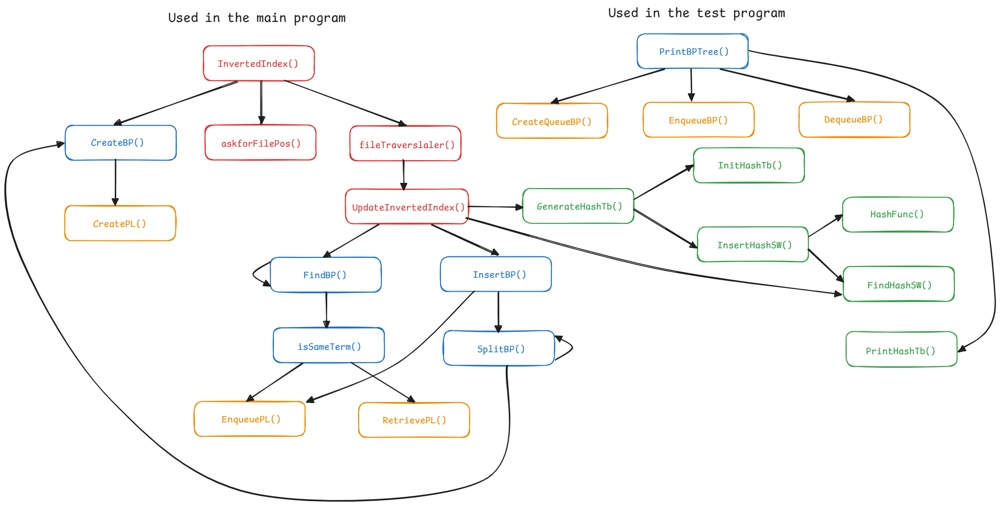
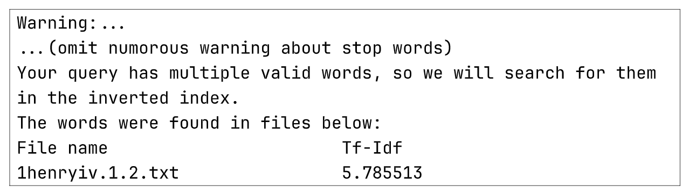

<!-- .slide: data-background="images/cover.png" -->

<div class="middle center title">
<div style="width: 100%">


# Project 1: Roll Your Own Mini Search Engine

<hr/>

Reporter: Qian Ziyang

Date: 2024/10/08

</div>
</div>


<!--s-->
<!-- .slide: data-background="images/cover.png" -->

<div class="middle center">
<div style="width: 100%">

# Part.1 Introduction of the Problem


</div>
</div>


<!--v-->
<!-- .slide: data-background="images/bg.png" -->

## Introduction

The project requires us to implement a **mini search engine** based on *The Complete Works of William Shakespeare*, which can return the corresponding articles according to the words users desire to query.


<div style="text-align: center; margin-top: 60px">
    
    
</div>

<!--v-->
<!-- .slide: data-background="images/bg.png" -->

## Introduction

In addition, this search engine has the features below:

- **Word count** for over the article set and attain the **stop words**(i.e. meaningless words while searching) from this set.
- Use the **inverted file index** to store and access all words with their frequency and location.
- The precision and recall can be adjusted by setting the threshold of **queries**.


<!--s-->
<!-- .slide: data-background="images/cover.png" -->

<div class="middle center">
<div style="width: 100%">

# Part.2 Key Data Structures and Algorithms

</div>
</div>

<!--v-->
<!-- .slide: data-background="images/bg.png" -->

## Overview

We have used these major data structures and algorighms below:

- Word Count & Stop Words:
    - C++ STL: `map`、`set`、`vector`
- Inverted Index:
    - B+ Trees
        - Queue
    - Hashing
- Query/Search:
    - TF-IDF Algorithm
    - C++ STL: `map`、`unordered_map`

<!--v-->

## Stop Words

- Traverse all texts and use STL containers `map` and `set` to map words to a set of work titles containing the word
- Use the sort function to sort the set by size to get a descending word list.
- Consider words with a frequency greater than or equal to a selected threshold as stop words

<div class="mul-cols">

<div class="col">

<div class="fragment" style="text-align: center">
    
</div>

</div>

<div class="col">

<div class="fragment" style="text-align: center">
    
</div>

</div>

<div class="col">

<div class="fragment" style="text-align: center">
    
</div>

</div>

</div>


<!--v-->
<!-- .slide: data-background="images/bg.png" -->


## Inverted Index

<div style="text-align: center">
    
</div>


<!--v-->
<!-- .slide: data-background="images/bg.png" -->

## Inverted Index

- <span style="color: red">Red</span>: Overall Functions/Wrappers
- <span style="color: blue">Blue</span>: Operations of B+ Trees
- <span style="color: green">Green</span>: Operations of Hashing
- <span style="color: orange">Orange</span>: Other Trivial Functions

<!--v-->
<!-- .slide: data-background="images/bg.png" -->

## Overall Functions/Wrappers

- `InvertedIndex()`: The overall wrapper for all operations regarding the inverted index
    - `askforFilePos()`: Ask for the position of the directory or file
    - `fileTraversaler()`: Traverse all files(or a single file) and build the inverted index from them(or it)
        - `UpdateInvertedIndex()`: Update the Inverted Index while reading a new document

<!--v-->
<!-- .slide: data-background="images/bg.png" -->

## B+ Trees

<div style="text-align: center">
    
</div>


<!--v-->
<!-- .slide: data-background="images/bg.png" -->

## B+ Trees -- Objects

<div class="mul-cols">
<div class="col">

``` c [1-8|9-13|]
// Nodes in B+ Trees
typedef struct nodebp {
    int size;
    int childrenSize;
    Data data[ORDER + 1];      
    NodeBP children[ORDER + 1];
    NodeBP parent;          
} * NodeBP;

// Data of the node in B+ Trees
typedef struct data {
    string term;
    PosList poslist;
} * Data;
```

</div>

<div class="col">

<div class="fragment">

``` c [1-6|8-12|]
// List of the position of terms
typedef struct poslist {
    int size;
    PosData front;
    PosData rear;
} * Poslist;

// The specific position info 
struct posdata {
    int pos;
    int time;
} * PosData;
```

</div>

</div>

</div>

<!--v-->
<!-- .slide: data-background="images/bg.png" -->

## B+ Trees -- Operations

``` cpp [|3-16]
BplusTree CreateBP();  // Create a B+ tree

// Find a term in B+ tree
NodeBP FindBP(string term, int docCnt, BplusTree T, bool * flag, 
                bool isSearch = false);

// Check if the term is in the B+ tree
void isSameTerm(string term, int docCnt, NodeBP nodebp, bool * flag, 
                bool isSearch = false);

// Insert a term into the B+ tree
BplusTree InsertBP(string term, int docCnt, NodeBP nodebp, 
                BplusTree Tree);

// Split the node when the node is full
BplusTree SplitBP(NodeBP nodebp, BplusTree Tree);

void PrintBPTree(BplusTree T);  // Print the B+ tree(level-order traversal)
```

<!--v-->
<!-- .slide: data-background="images/bg.png" -->

## `FindBP()`

<div style="text-align: center">
    
</div>

<!--v-->
<!-- .slide: data-background="images/bg.png" -->

## `isSameTerm()`

<div class="mul-cols">

<div class="col">

<div style="text-align: center">
    
</div>

</div>

<div class="col">

<div style="text-align: center">
    
    
</div>

</div>

</div>

<!--v-->
<!-- .slide: data-background="images/bg.png" -->

## `InsertBP()`

<div style="text-align: center">
    
</div>

<!--v-->
<!-- .slide: data-background="images/bg.png" -->

## `SplitBP()`

<div style="text-align: center">
    
</div>


<!--v-->
<!-- .slide: data-background="images/bg.png" -->

## `SplitBP()`

<div style="text-align: center">
    
</div>


<!--v-->
<!-- .slide: data-background="images/bg.png" -->

## `SplitBP()`

<div style="text-align: center">
    
</div>

<!--v-->
<!-- .slide: data-background="images/bg.png" -->

## `SplitBP()`

<div style="text-align: center">
    
</div>


<!--v-->
<!-- .slide: data-background="images/bg.png" -->

## `SplitBP()`

<div style="text-align: center">
    
</div>

<!--v-->
<!-- .slide: data-background="images/bg.png" -->

## Hashing 

``` cpp [|1-2|3-10|11-12|]
// Build a hash table
HashTb GenerateHashTb();
// Initialization of the hash table
HashTb InitHashTb();
// Find the stopwords or other words in the hash table
int FindHashSW(string stopword, HashTb H, bool justSearch);
// Insert a new stopword in hash table
void InsertHashSW(string stopword, HashTb H);
// Hashing function
int HashFunc(string stopword, int size);
// Print hash table
void PrintHashTb(HashTb H);
```

<!--v-->
<!-- .slide: data-background="images/bg.png" -->

## Query

- **Query parsing**: 
    - break the query string down into words
    - convert words to an appropriate form
    - check for the existence and validity 
- **Valid word collection**
- **Search condition assessment**:
    - single valid word: search directly and return the matching docs with TF values
    - multiple valid words: 
        - calculate their TF-IDF values and use a hash table to store these values and doc IDs additionally.

<!--v-->
<!-- .slide: data-background="images/bg.png" -->

## Query

- **Result sorting and output**: 
    - the results are sorted based on the TF-IDF values
    - print the results(with limitation)


<!--v-->
<!-- .slide: data-background="images/bg.png" -->

## TF-IDF Algorithm

[TF-IDF Algorithm](https://en.wikipedia.org/wiki/Tf%E2%80%93idf)(term frequency–inverse document frequency): A measure of importance of a word to a document in a corpus, adjusted for the fact that some words appear more frequently in general. In our project, we use the following formula to calculate tf, idf and tf-idf.

<div class="fragment">

$$
\text{tf}\left ( \text{word},\text{doc} \right )  = \frac{\text{num of word in the doc} }{ \text{total word count of the doc} } 
$$

</div>

<div class="fragment">

$$
\text{idf}\left ( \text{word},\text{doc} \right ) = \log{\frac{\text{total num of documents} }{1+\left | \text{num of documents that include the word} \right| }}
$$

</div>

<div class="fragment">

$$
\text{tf-idf}\left ( \text{word},\text{doc} \right )=\text{tf}\times\text{idf}
$$

</div>

<!--s-->
<!-- .slide: data-background="images/cover.png" -->

<div class="middle center">
<div style="width: 100%">

# Part.3 Testing Results

</div>
</div>

<!--v-->
<!-- .slide: data-background="images/bg.png" -->

## Inverted Index

- Correctness tests
    - Insert words into inverted index correctly
    - Distinguish stop words correctly
- Speed test

<div class="fragment" style="text-align: center; margin-top: 30px">
    
</div>


<!--v-->
<!-- .slide: data-background="images/bg.png" -->

## Speed Test

<div style="text-align: center; margin-top: 0px">
    
</div>

<div class="fragment">

$$
y = a \cdot x \log x + b
$$

</div>

<!--v-->
<!-- .slide: data-background="images/bg.png" -->

## Query

- input0: `1000 * 'a'`
    - test for illegal words of extreme length

<div class="fragment" style="text-align: center; margin-top: 0px">
    
</div>


<!--v-->
<!-- .slide: data-background="images/bg.png" -->

## Query

- input1: `peas and beans`
    - one stop word, two rare words, but all appearing in only one document

<div class="fragment" style="text-align: center; margin-top: 0px">
    
</div>


<!--v-->
<!-- .slide: data-background="images/bg.png" -->

## Query

- input2: blank input
    - test for blank input

<div class="fragment" style="text-align: center; margin-top: 0px">
    
</div>

- input3: `call other man` (they are all stop words)
    - test for stop words

<div class="fragment" style="text-align: center; margin-top: 0px">
    
</div>

<!--v-->
<!-- .slide: data-background="images/bg.png" -->

## Query

- input4: complete article `1henryiv.1.2`
    - Test for extreme length of correct text and the performance of searches at different thresholds

<div class="fragment" style="text-align: center; margin-top: 0px">
    
</div>

<!--v-->
<!-- .slide: data-background="images/bg.png" -->

## Query

- input5: `All sects, all ages smack of this vice; and he To die for’t!`(chosen from `measure.2.2`)
    - test the effect of the threshold on search results

<div class="mul-cols">

<div class="col">

<div class="fragment" style="text-align: center; margin-top: 0px">
    
</div>

</div>

<div class="col">

<div class="fragment">

<div style="text-align: center; margin-top: 0px">
    
</div>

From the test results, we can see that the works can be correctly screened
out with a threshold of about 0.4.

</div>

</div>

</div>


<!--s-->
<!-- .slide: data-background="images/cover.png" -->

<div class="middle center">
<div style="width: 100%">

# Part.4 Conclusions

</div>
</div>

<!--v-->
<!-- .slide: data-background="images/bg.png" -->

## Space Complexity

Colclusion: $O(W + D + H + I + M + K)$

- Word count: 
    - $W$: word count in all files
    - $D$: the number of files(docs)
- Stop words:
    - $H$: the size of hash table, also represents the size of stop words


<!--v-->
<!-- .slide: data-background="images/bg.png" -->

## Space Complexity

Colclusion: $O(W + D + H + I + M + K)$

- Inverted index:
    - $I = N \times \text{ORDER}$, the size of inverted index
        - $N$: the **size** of B+ tree
        - $\text{ORDER}$: the **order** of the B+ tree
- Query:
    - $M$: The number of valid words stored by `queryWord()`
    - $K$:  The number of found documents for a single word when calling `posVec()`


<!--v-->
<!-- .slide: data-background="images/bg.png" -->

## Time Complexity

Conclusion: $O(W \log W + n + m \log m + X)$

- Word count and stop words:
    - $W$: Word count all articles in _The Works_
- Inverted Index: $W \log W$
    - All words will be inserted into the inverted index tree
    - The time complexity of insertion is $O(\log W)$
    - Therefore, the overall complexity of building an inverted index is $O(W \log W)$

<!--v-->
<!-- .slide: data-background="images/bg.png" -->

## Time Complexity

Conclusion: $O(W + W \log W + n + m \log m + X)$

- Query:
    - $n$: The query string of length
    - $m$: The number of valid words
        - These valid words will be sorted, and the known fastest sort algorithm costs $O(m \log m)$ time 


<!--v-->
<!-- .slide: data-background="images/bg.png" -->

## Time Complexity

Conclusion: $O(W + W \log W + n + m \log m + X)$

- Query:
    - $X$: Vary in different situation
        - **single** valid word: $k \log k$, where $k$ is the number of resulting documents. The results will be sorted before printing
        - **multiple** valid words: $m \times (p \log p)$, where $p$ is the total document results in worst-case scenario


<!--s-->
<!-- .slide: data-background="images/cover.png" -->

<div class="middle center title">
<div style="width: 100%">


# Thanks for Listening!

<hr/>

Any Questions?